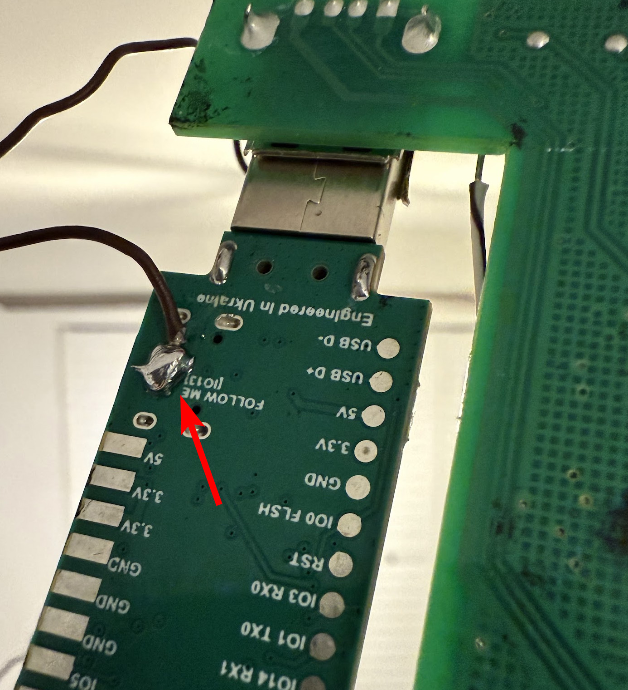
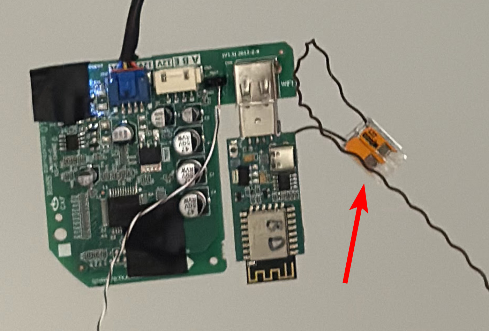
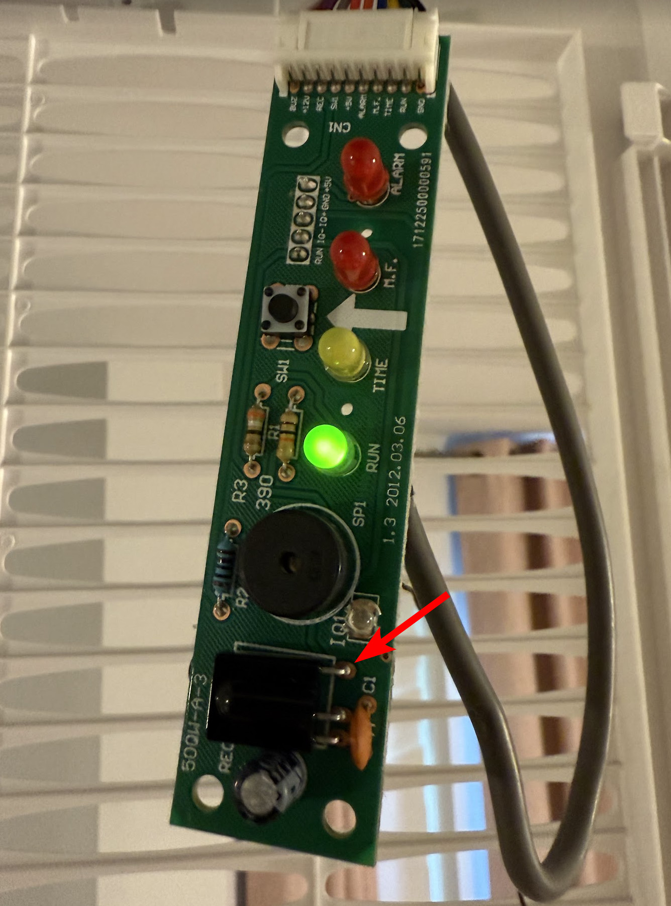
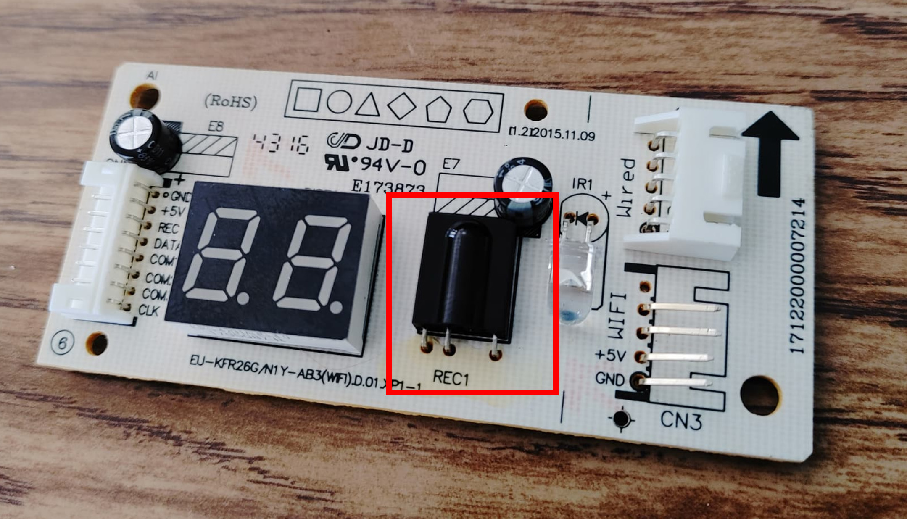
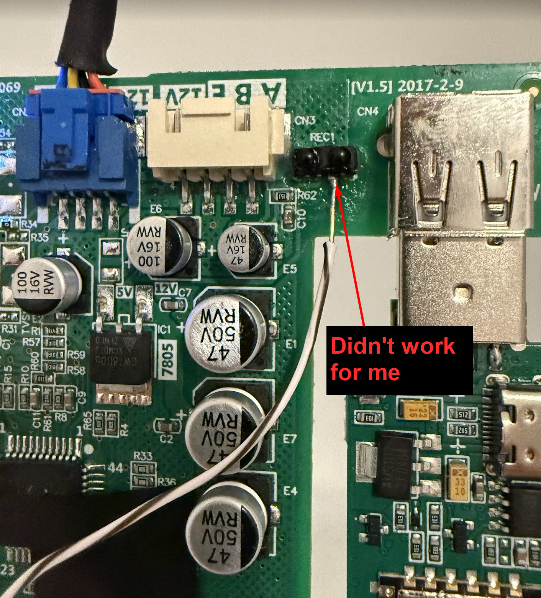
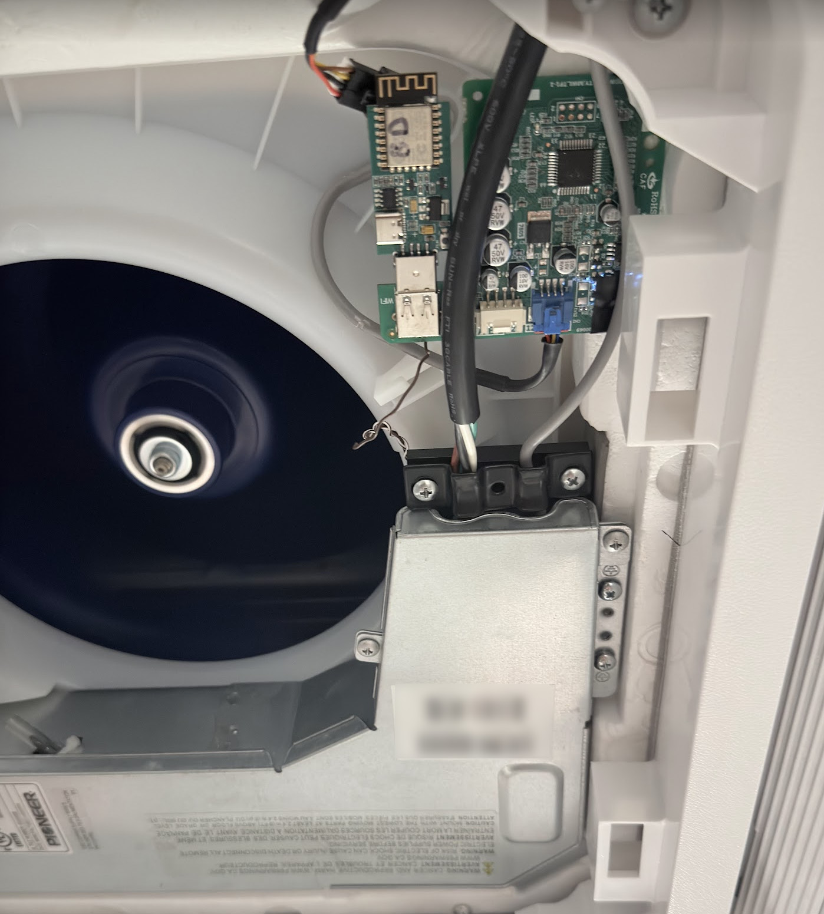
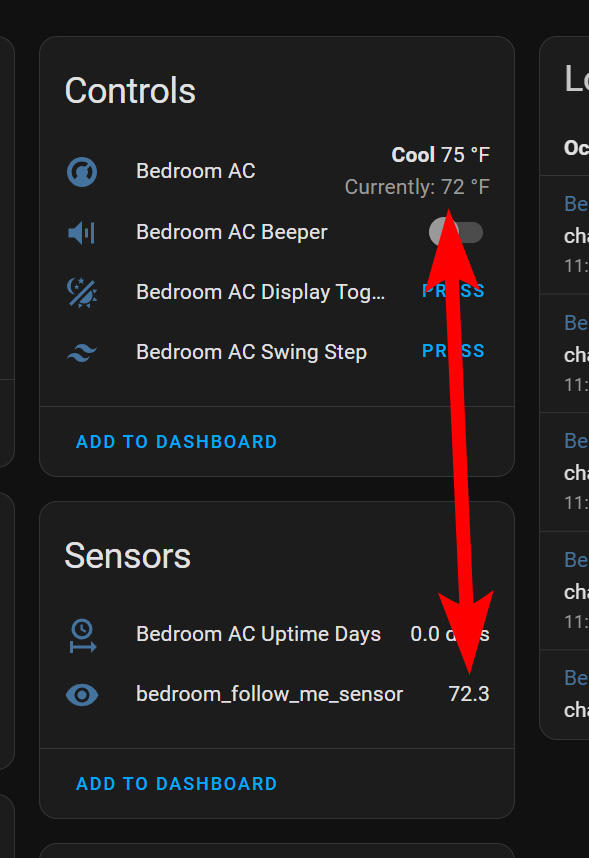

While setting up the Follow Me feature on my `SLWF-01Pro` I found that the documentation is sparse so hopefully this guide clears it up.

## Problem

Most mini splits have the temperature sensor on the intake of the unit. This leads to the unit thinking that the temperature is much cooler/warmer than the room actually is. This temperature delta is even greater for ceiling mounted units. 

## Solution

Use an external temperature sensor from Home Assistant and feed it back to the unit.

## What you'll need 

- SLWF-01Pro
- Soldering iron + bare minimum soldering skills
- Thin wire (I used Cat6)
- Splicing connector (optional)
- External temperature sensor in Home Assistant

I've only tested this on wall and ceiling mount Pioneer (Midea) units. Your millage may vary for other brands.


## Soldering

Start by soldering one end of the wire to the `IO13` pin on the back of the `SLWF-01Pro`. 



Before moving on it might be a good idea to cut the cable in half and use a [Wago](https://www.wago.com/us/wire-splicing-connectors/compact-splicing-connector/p/221-412) or other splicing connector to put the two ends back together. In the future this will allow you to separate the two boards without having to remove the solder. 



Solder the other end of the wire to the `OUT` pin on IR receiver/control board of the unit. My board had some kind of coating that prevented the solder from sticking correctly. Make sure to clean the surface in order to have good contact.



Your board might look different but the IR receiver usually looks like the one shown below. The `OUT` pin is usually the one by itself (right pin below), but this can vary so verify before doing any soldering.



My cassette requires a `WF-60A1` in order to use the `SLWF-01Pro` Wi-Fi module. Originally I tried soldering directly to the [IR receiver](https://www.vishay.com/docs/82481/tssp77p38.pdf) on the `WF-60A1`, but that did not work.



At this point you can put everything back together. I opted to remove the plastic from the `WF-60A1` and just place the board in an empty space in the cassette.



## Configuration

I am using the configuration found [here](https://smartlight.me/smart-home-devices/wifi-devices/wifi-dongle-air-conditioners-midea-idea-electrolux-for-home-assistant) under `Downloads > YAML config for r2.1 board`.

Below is the config I added to the `sensor` section to test:

```yaml
sensor:
  - platform: homeassistant
    entity_id: sensor.aqara_bedroom_temperature                 #external temp sensor in HA - F unit
    id: bedroom_follow_me_sensor
    internal: false                                             # set to false so that you can see it in HA
    name: "bedroom_follow_me_sensor"
    filters:
      - throttle: 10s
      - heartbeat: 1min                                         # send updates every 1 min (during testing)
      - debounce: 1s
    on_value:
      midea_ac.follow_me:
        temperature: !lambda "return ((x - 32.0) * (5.0/9.0)) ;"  # convert F to C
        #temperature: !lambda "return x;"                       # use this instead if your temp sensor is in C
        beeper: true                                            # beep every time there is an update
```


Things to note: 
 - During testing set the `heartbeat` to 1 minute, and `beeper: true`. This will quickly give you feedback.
 - My sensor returns the temperature in Fahrenheit, but the unit expects Celsius. As a result I need to convert using `((x - 32.0) * (5.0/9.0))`. 
 
## How do I know it worked?

During testing the unit should receive an update and beep every 1 minute. 

Open the device in HA and observe the values shown. In my instance `Current temp` and `bedroom_follow_me_sensor` should have almost identical values.



-----------
 
Below is the final config once I confirmed everything was working:

```yaml
sensor:
  - platform: homeassistant
    entity_id: sensor.aqara_bedroom_temperature                 #external temp sensor in HA - F unit
    id: bedroom_follow_me_sensor
    internal: false                                             # set to false so that you can see it in HA
    name: "bedroom_follow_me_sensor"
    filters:
      - throttle: 10s
      - heartbeat: 2min                                         # send updates every 2 min
      - debounce: 1s
    on_value:
      midea_ac.follow_me:
        temperature: !lambda "return ((x - 32.0) * (5.0/9.0)) ;"  # convert F to C
        beeper: false
```

## Troubleshooting

- Turn the breaker off/on to restart everything.
- Make sure that you cleaned the surface of the PCB correctly in order to get good solder contact.
- Make sure you soldered to the correct leg of the IR receiver.
- Makes sure all your connections to the unit are good.
- If using thin wire make sure it did not get cut while working with it.
